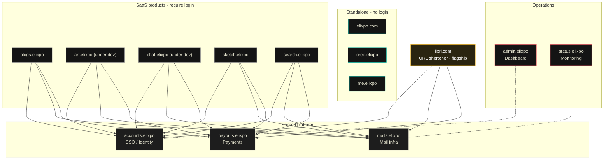

<!--
  ELIXPO README - STANDARD TEMPLATE
  This is the canonical README format for every Elixpo repository.
  Keep the section order. Fill the "Exclusive" section only if this repo ships
  something exclusive (an npm package, a VS Code extension, a hosted service,
  a paid tier). Otherwise state "None" and rely on the base sections.
-->

<p align="center">
  
</p>

<h1 align="center">Elixpo</h1>

<p align="center">
  <strong>An open, ethical, and accessible ecosystem of AI and developer tools.</strong><br/>
  Free and open source, built by a global community of 45+ contributors.
</p>

<p align="center">
  <a href="https://elixpo.com">Website</a> ·
  <a href="https://github.com/orgs/elixpo/discussions">Discussions</a> ·
  <a href="https://github.com/elixpo/elixpo_chapter">Monorepo</a> ·
  <a href="https://github.com/sponsors/Circuit-Overtime">Sponsor</a>
</p>

---

## About

Elixpo started in 2023 as a small college initiative and has grown into a
collaborative, community-driven ecosystem of interconnected tools for creating,
writing, drawing, searching, and building on the web.

Our belief is simple: **AI and great software should be open, ethical, and free
for everyone.** Every tool below is open source, free to use, and shaped by
contributors from around the world. No paywalls, no premium tiers, no sign-up
walls on our public tools.

> This repository is the source for the **elixpo.com** website - the public face
> of the ecosystem.

## The ecosystem

| Tool | What it does | Link |
| --- | --- | --- |
| 🎨 **Elixpo Art** | AI image generation _(under dev)_ | [art.elixpo.com](https://elixpo.com) |
| ✍️ **Elixpo Blogs** | A rich, modern writing and publishing space | [blogs.elixpo.com](https://blogs.elixpo.com) |
| 🖊️ **LixSketch** | A hand-drawn style whiteboard for ideas and diagrams | [sketch.elixpo.com](https://sketch.elixpo.com) |
| 💬 **Elixpo Chat** | A fluid, real-time AI chat experience _(under dev)_ | [chat.elixpo.com](https://chat.elixpo.com) |
| 🔎 **Elixpo Search** | Fast, AI-assisted search | [search.elixpo.com](https://search.elixpo.com) |
| 👤 **Elixpo Accounts** | One identity (SSO) across the ecosystem | [accounts.elixpo.com](https://accounts.elixpo.com) |
| 🔗 **lixrl** | Our flagship URL shortener | [lixrl.com](https://lixrl.com) |
| 🪪 **Portfolios** | Personal pages to showcase your work | [me.elixpo.com](https://me.elixpo.com) |
| 🐼 **Oreo** | The mascot's home | [oreo.elixpo.com](https://oreo.elixpo.com) |

Developers can drop our editors into their own projects with the
**`@elixpo/lixsketch`** and **`@elixpo/lixeditor`** packages, on npm and as VS
Code extensions.

## Architecture

Everything runs on **Cloudflare**. Three shared platform services back the
ecosystem, and products are either **SSO-backed SaaS**, **standalone**, or our
**flagship**:

- **`accounts.elixpo`** - single sign-on / identity
- **`mails.elixpo`** - shared mailing infrastructure
- **`payouts.elixpo`** - shared payments / payouts

SaaS products (Blogs, Art, Chat, Sketch, Search) and the flagship **lixrl.com**
all authenticate through Accounts (SSO) and share the Mail and Payouts infra.
The public, login-free surfaces (**elixpo.com**, **oreo.elixpo**, **me.elixpo**)
are standalone. **admin.elixpo** is the operations dashboard and
**status.elixpo** is monitoring.



A rendered, interactive version lives at **[elixpo.com/architecture](https://elixpo.com/architecture)**.

## Built by the community

Elixpo is made by people, in the open. **45+ contributors** have shaped these
tools, with a small core team steering the way:

- **Ayushman Bhattacharya** - Founder & Lead ([@Circuit-Overtime](https://github.com/Circuit-Overtime))
- **Vivek Yadav** - Lead Co-Dev ([@ez-vivek](https://github.com/ez-vivek))
- **Anwesha Chakraborty** - Core Maintainer ([@anwe-ch](https://github.com/anwe-ch))

Everyone is welcome. See **[CONTRIBUTING.md](CONTRIBUTING.md)** and our
**[Code of Conduct](CODE_OF_CONDUCT.md)**.

## Recognition & programs

Elixpo has taken part in and been supported by **GSSOC**, **Hacktoberfest**,
**Pollinations.AI**, **MS Startup Foundations**, and **OSCI**.

## Get involved

- 💬 **Join the conversation** in [GitHub Discussions](https://github.com/orgs/elixpo/discussions).
- 🚀 **Submit your project** to be featured across the ecosystem.
- 🛠️ **Contribute** - browse good first issues in the [monorepo](https://github.com/elixpo/elixpo_chapter).
- ❤️ **Support us** via [GitHub Sponsors](https://github.com/sponsors/Circuit-Overtime).

## Brand assets

Brand-ready marks and per-service icons live under [`public/brand/`](public/brand/),
and the brand source of truth (mascot, palette, rules) is
[`brand/MASCOT.md`](brand/MASCOT.md). A browsable kit is at
**[elixpo.com/assets](https://elixpo.com/assets)**.

## License

Elixpo uses one **licensing standard** across every repository:

- **Code** - [MIT](LICENSES/preferred/MIT) (with the [Oreo-trademarks exception](LICENSES/exceptions/Oreo-trademarks)).
- **Brand & visual assets** - [CC-BY-4.0](LICENSES/preferred/CC-BY-4.0) (with the same exception).

The Oreo mascot, the chest E-badge, and the "Elixpo" and "Oreo" names, domains,
and palette are reserved - this protects the brand and its royalties while
keeping the code and assets free. See [`LICENSE`](LICENSE) and the per-product
notice board, [`NOTICE`](NOTICE).

## Exclusive

> Per-repo "exclusive" artifacts (an npm package, a VS Code extension, a hosted
> SaaS, a paid tier) are declared here and in [`NOTICE`](NOTICE).

**This repository:** None - it is the website source.

---

## Running this website locally

```bash
npm install
npm run dev
```

Then open [http://localhost:3000](http://localhost:3000).

<p align="center">
  <sub>Made in the open, together. © 2023-2026 Elixpo.</sub>
</p>
