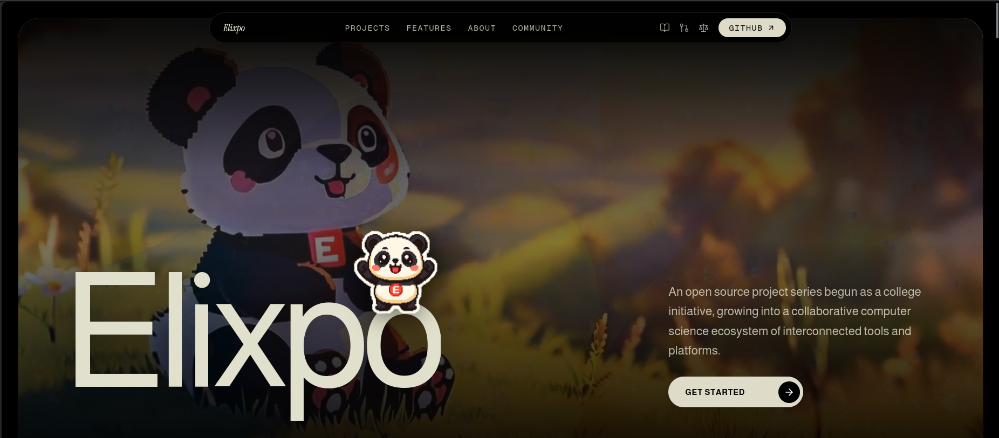

<p align="center">
  
</p>

<h1 align="center">Elixpo</h1>

<p align="center">
  <strong>An open, ethical, and accessible ecosystem of AI and developer tools.</strong><br/>
  Free and open source, built by a global community of 45+ contributors.
</p>

<p align="center">
  <a href="https://elixpo.com">Website</a> ·
  <a href="https://github.com/orgs/elixpo/discussions">Discussions</a> ·
  <a href="https://github.com/elixpo/elixpo_chapter">Monorepo</a> ·
  <a href="https://github.com/sponsors/Circuit-Overtime">Sponsor</a>
</p>

---

## What is Elixpo?

Elixpo started in 2023 as a small college initiative and has grown into a
collaborative, community-driven ecosystem of interconnected tools for creating,
writing, drawing, searching, and building on the web.

Our belief is simple: **AI and great software should be open, ethical, and free
for everyone.** Every tool below is open source, free to use, and shaped by
contributors from around the world. No paywalls, no premium tiers, no sign-up
walls on our public tools.

## The Ecosystem

| Tool | What it does | Link |
| --- | --- | --- |
| 🎨 **Elixpo Art** | AI image generation, free for everyone | [elixpo.com](https://elixpo.com) |
| ✍️ **Elixpo Blogs** | A rich, modern writing and publishing space | [blogs.elixpo.com](https://blogs.elixpo.com) |
| 🖊️ **LixSketch** | A hand-drawn style whiteboard for ideas and diagrams | [sketch.elixpo.com](https://sketch.elixpo.com) |
| 💬 **Elixpo Chat** | A fluid, real-time AI chat experience | [chat.elixpo.com](https://chat.elixpo.com) |
| 🔎 **Elixpo Search** | Fast, AI-assisted search | [search.elixpo.com](https://search.elixpo.com) |
| 👤 **Elixpo Accounts** | One identity across the ecosystem | [accounts.elixpo.com](https://accounts.elixpo.com) |
| 🔗 **Elixpo URL** | A simple, custom URL shortener | [url.elixpo.com](https://url.elixpo.com) |
| 🪪 **Portfolios** | Personal pages to showcase your work | [me.elixpo.com](https://me.elixpo.com) |

Developers can also drop our editors straight into their own projects with the
**`@elixpo/lixsketch`** and **`@elixpo/lixeditor`** packages, available on npm and
as VS Code extensions.

## Built by the community

Elixpo is made by people, in the open. **45+ contributors** across the world
have shaped these tools, with a small core team steering the way:

- **Ayushman Bhattacharya** - Founder & Lead ([@Circuit-Overtime](https://github.com/Circuit-Overtime))
- **Vivek Yadav** - Lead Co-Dev ([@ez-vivek](https://github.com/ez-vivek))
- **Anwesha Chakraborty** - Core Maintainer ([@anwe-ch](https://github.com/anwe-ch))

Everyone is welcome - designers, writers, first-time contributors, and seasoned
developers alike.

## Recognition & programs

Elixpo has taken part in and been supported by **GSSOC**, **Hacktoberfest**,
**Pollinations.AI**, **MS Startup Foundations**, and **OSCI**.

## Get involved

- 💬 **Join the conversation** in our [GitHub Discussions](https://github.com/orgs/elixpo/discussions) - introduce yourself, share a project, or ask anything.
- 🚀 **Submit your project** to be featured across the ecosystem.
- 🛠️ **Contribute** - browse good first issues in the [monorepo](https://github.com/elixpo/elixpo_chapter).
- ❤️ **Support us** via [GitHub Sponsors](https://github.com/sponsors/Circuit-Overtime) to help cover infrastructure costs.

## License

Elixpo is open source and free to build on:

- **Code** is licensed under the **MIT License** (with an Oreo-trademark exception).
- **Visual assets** are licensed under **CC-BY-4.0**.

The Oreo mascot, the chest E-badge, and the "Elixpo" and "Oreo" names and brand
palette are reserved. See [`LICENSE`](LICENSE) for the full terms.

---

<p align="center">
  Made in the open, together. © 2023-2026 Elixpo.
</p>

<details>
<summary>Running this website locally</summary>

This repository contains the Elixpo marketing site (a Next.js app).

```bash
npm install
npm run dev
```

Then open [http://localhost:3000](http://localhost:3000).

</details>
